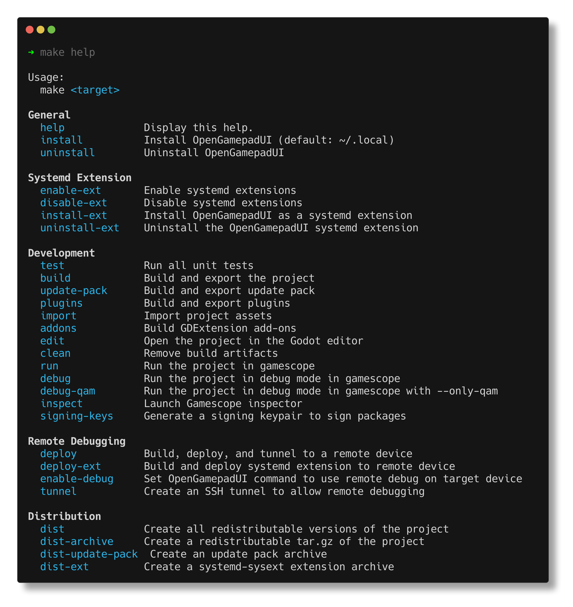

Building from source
====================

Getting the source
------------------

Before building OpenGamepadUI, you first need to actually download the
source code using ``git``. Ensure you have ``git`` installed, and run
the following to clone the project locally:

.. code:: bash

   git clone https://github.com/ShadowBlip/OpenGamepadUI.git

Build Requirements
------------------

The following are required to build Open Gamepad UI:

-  Godot 4.x
-  GCC 7+ or Clang 6+.
-  Python 3.5+.
-  SCons 3.0+ build system
-  pkg-config (used to detect the dependencies below).
-  X11, Xcursor, Xinerama, Xi and XRandR development libraries.
-  MesaGL development libraries.
-  ALSA development libraries.
-  PulseAudio development libraries.
-  Evdev development libraries
-  make (optional)
-  unzip (optional)
-  wget (optional)

If you are using ArchLinux, you can run the following:

.. code:: bash

   pacman -S --needed scons pkgconf gcc gcc-libs libxcursor libxinerama libxi libxrandr mesa glu libglvnd alsa-lib make cmake unzip wget git libevdev libxau libxcb libxdmcp libxext libxres libxtst squashfs-tools godot

Building
--------

OpenGamepadUI uses ``make`` to help make developing the project easier.
You can view the things you can do with ``make`` by running
``make help``:

You can build the OpenGamepadUI binary using the following:

.. code:: bash

   make build

Godot imports and converts assets when it builds. If you see errors
related to failing to load resources. Try running:

.. code:: bash

   make import

Usage
-----

Open Gamepad UI works in conjunction with
`gamescope <https://github.com/Plagman/gamescope/>`__ to manage
launching games in a seamless way.

To run OpenGamepadUI, run the following to launch through gamescope:

.. code:: bash

   make run

You can also run OpenGamepadUI in gamescope in debug mode with the Godot
editor open with:

.. code:: bash

   make debug

